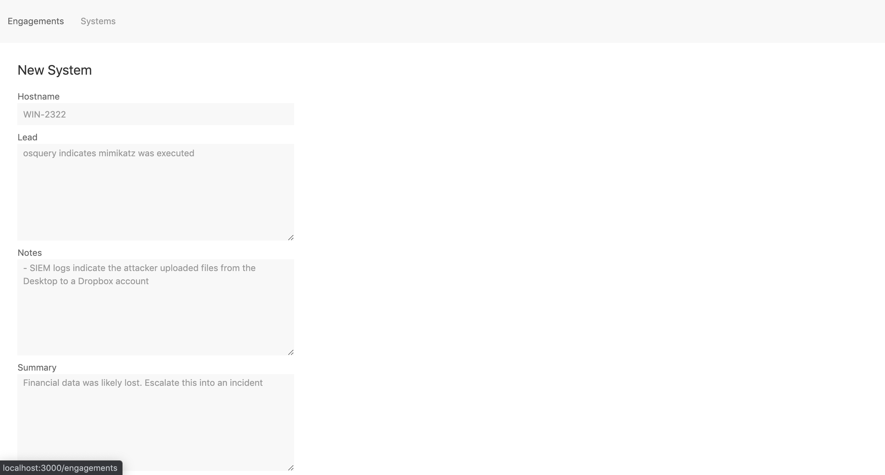

# Live Response Analysis Tracker

After graduating from college, I worked as an incident response consultant at Mandiant.

My job was to do live response analyses of different servers and workstations from our clients' environments that we suspected an attacker had accessed.

(Think of a live response analysis as doing a forensic analysis of a hard disk, except that in order
to avoid imaging and uploading an entire hard disk, we extract several key artifacts from the endpoint.)

I built this basic CRUD web app to help me track my live response analyses, instead of using
a spreadsheet or Google Doc.

[Video demo (26 seconds)](https://www.youtube.com/watch?v=AoT-8jU3dzM)

## Screenshots

List engagements:


List systems to analyze:


Create a live response analysis:


## Tech Stack

- Ruby on Rails
- Turbolinks
- UIKit

## To Run

```
rails db:create db:migrate
rails s
```

Open `http://localhost:3000`

## Warning

LR Tracker saves data in a sqlite3 database (development.db) locally. This is intentional, to avoid storing customer data in the cloud.

However, this means there is a risk of data loss. If you'd like to store your data in Postgres/MySQL/etc, please open an issue or create a pull request.
