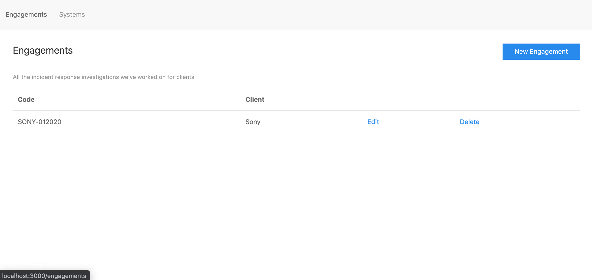

# Live Response Analysis Tracker

As an incident response consultant, I built this Rails-based CRUD application to help me organize my live response analyses.

## Screenshots

List engagements:
  

List systems to analyze:
  

Edit a live response analysis:


## To Run

```
rails db:create db:migrate
rails s
```

Open `http://localhost:3000`

## Warning

LR Tracker saves data in a sqlite3 database (development.db) locally. This is intentional, to avoid storing customer data in the cloud.

However, this means there is a risk of data loss. If you'd like to store your data in Postgres/MySQL/etc, please open an issue or create a pull request.

## Upcoming features

- Section for action items. Populated by default with:
    - Tagged lead in IRIS
    - Did hit review
- Section for dates to timeline around
    - Can add filter to a date
